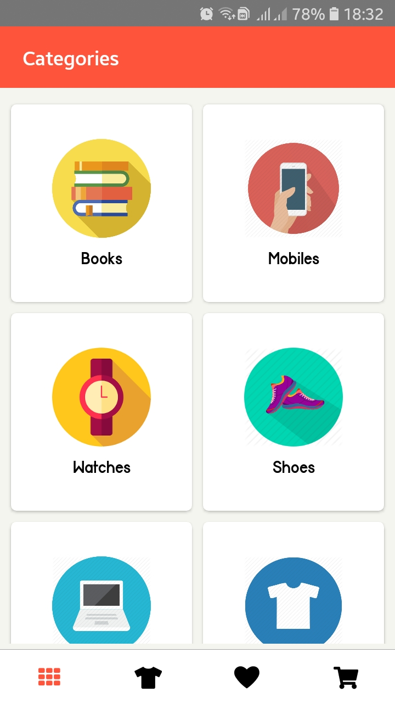
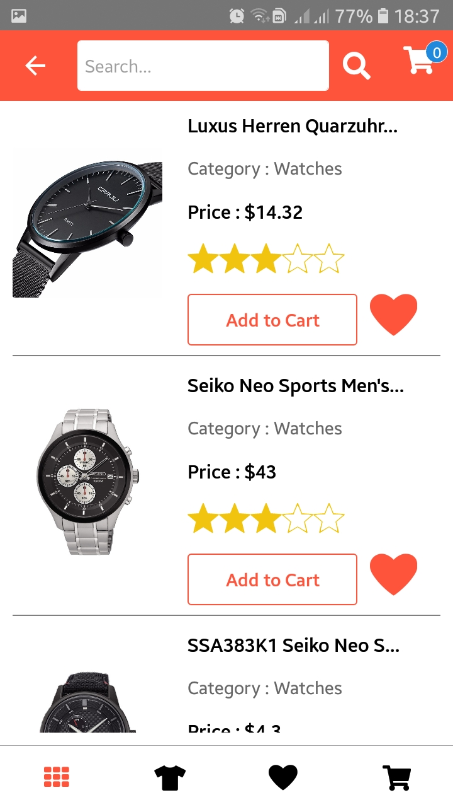
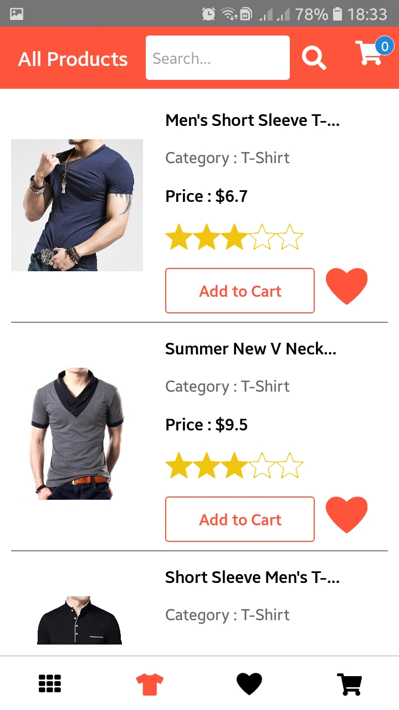
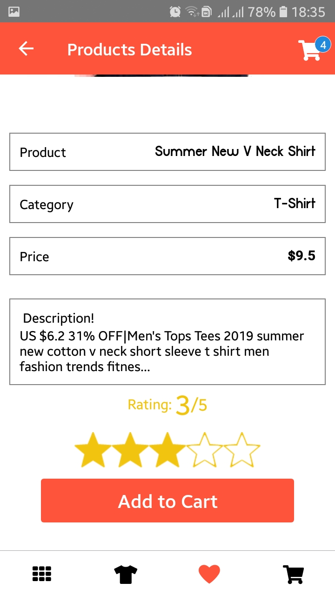
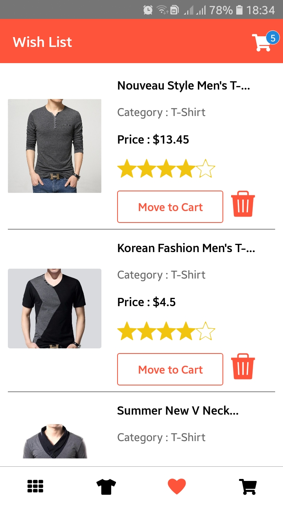
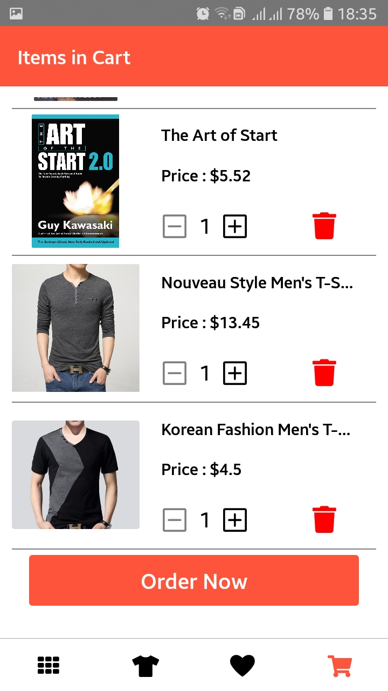
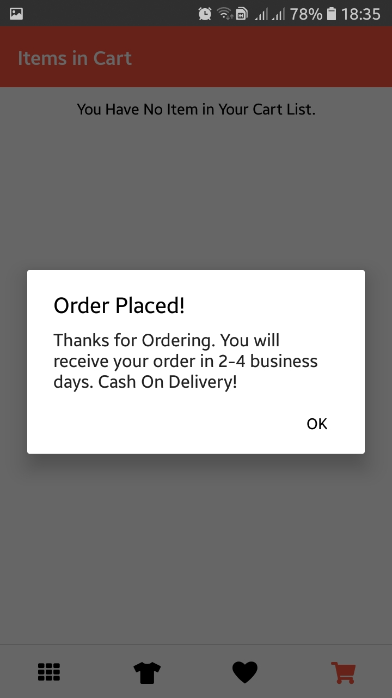

# React-Native-Shopping-App
A simple Shopping App in React Native. For Complete Functionality... check https://www.youtube.com/watch?v=Lf0MLrcSx0Q
# Close the app and run "npm install" in root folder

# Screen Shots

  
  
  
  
